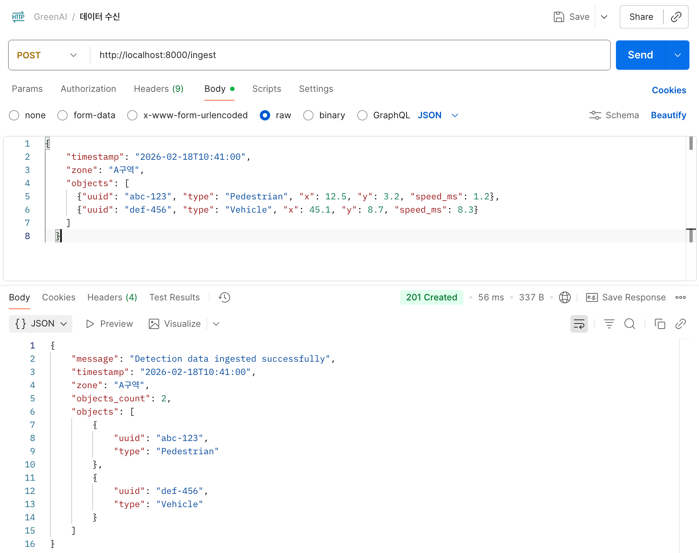
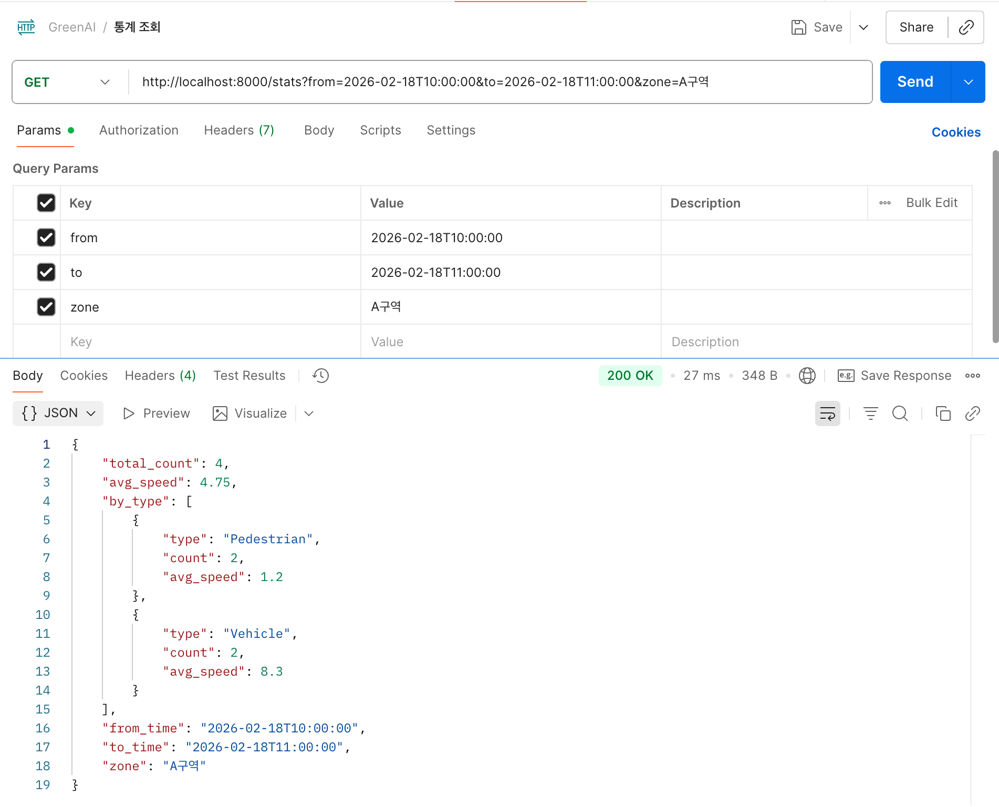
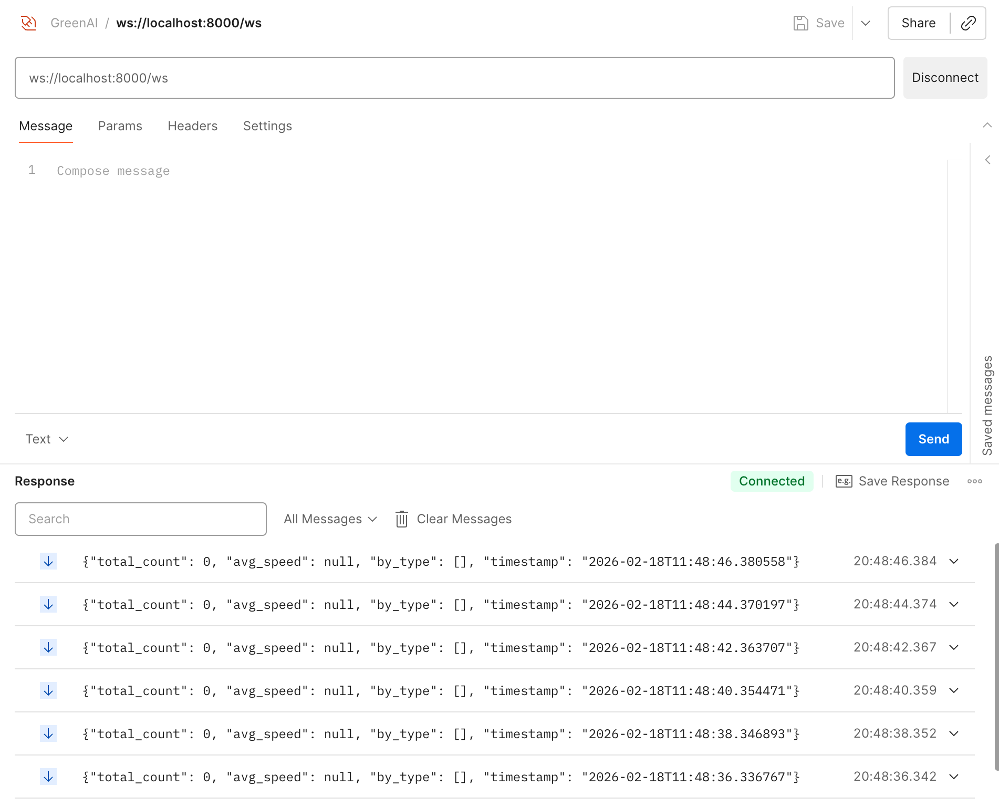

# GreenAI Dashboard

실시간 객체 감지 데이터 파이프라인 대시보드

## 프로젝트 개요

실시간 데이터 수신 → 저장/집계 → 대시보드 실시간 갱신 흐름을 구현한 축소 재현 프로젝트입니다.

```
[카메라/센서] → POST /ingest → [FastAPI] → [SQLite]
                                   ↓
                          GET /stats / WS /ws
                                   ↓
                          [React Dashboard]
```

## 기술 스택

| 구분 | 기술 |
|------|------|
| Backend | FastAPI, SQLAlchemy, SQLite, Pydantic, WebSocket |
| Frontend | React 18, TypeScript, Vite |
| Infra | Docker, Docker Compose |

## 프로젝트 구조

```
GreenAI-Dashboard/
├── backend/
│   ├── main.py                # FastAPI 앱 및 엔드포인트
│   ├── database.py            # SQLAlchemy 설정
│   ├── models.py              # DB 모델
│   ├── requirements.txt       # Python 의존성
│   ├── Dockerfile
│   └── generate_dummy_data.py # 더미 데이터 생성 스크립트
├── frontend/
│   ├── src/
│   │   ├── components/        # KpiCard, TypeBadge
│   │   ├── hooks/             # useWebSocket
│   │   ├── App.tsx            # 메인 대시보드 페이지
│   │   └── types.ts           # TypeScript 타입 정의
│   └── package.json
├── docker-compose.yml
└── README.md
```

## 실행 방법

```bash
# 백엔드 + 프론트엔드 전체 실행
docker-compose up --build

# 백엔드만 실행
docker-compose up -d backend
```

| 서비스 | URL |
|--------|-----|
| 프론트엔드 | http://localhost:3000 |
| 백엔드 API | http://localhost:8000 |
| API 문서 (Swagger) | http://localhost:8000/docs |

## API

### POST /ingest - 데이터 수신

```bash
curl -X POST http://localhost:8000/ingest \
  -H "Content-Type: application/json" \
  -d '{
    "timestamp": "2026-02-18T10:30:00",
    "zone": "A구역",
    "objects": [
      {"uuid": "abc-123", "type": "Pedestrian", "x": 12.5, "y": 3.2, "speed_ms": 1.2},
      {"uuid": "def-456", "type": "Vehicle", "x": 45.1, "y": 8.7, "speed_ms": 8.3}
    ]
  }'
```

지원 타입: `Pedestrian` / `Bike` / `Vehicle` / `LargeVehicle`

### GET /stats - 통계 조회

```bash
# 시간 범위 지정
curl "http://localhost:8000/stats?from=2026-02-18T10:00:00&to=2026-02-18T11:00:00"

# 구역 필터 추가
curl "http://localhost:8000/stats?from=2026-02-18T10:00:00&to=2026-02-18T11:00:00&zone=A구역"
```

**응답 예시:**
```json
{
  "total_count": 2,
  "avg_speed": 4.75,
  "by_type": [
    {"type": "Pedestrian", "count": 1, "avg_speed": 1.2},
    {"type": "Vehicle", "count": 1, "avg_speed": 8.3}
  ]
}
```

데이터 없을 때: `total_count: 0`, `avg_speed: null`, `by_type: []`

### WS /ws - 실시간 KPI

WebSocket 연결 시 2초마다 최근 5분 KPI 데이터를 자동 전송합니다.

```bash
# wscat으로 테스트
npx wscat -c ws://localhost:8000/ws
```

## 스크린샷

### POST /ingest - 데이터 수신


### GET /stats - 통계 조회


### WS /ws - WebSocket 실시간 연결


## 더미 데이터 생성

```bash
cd backend
python generate_dummy_data.py  # 3초마다 랜덤 데이터 전송
```
